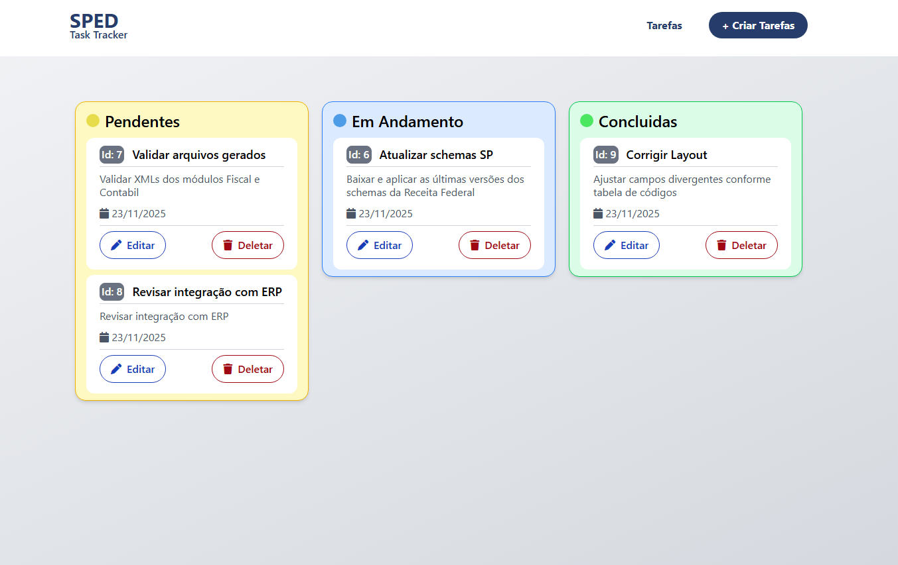

# Sped Task Tracker – Frontend + Backend

Este projeto consiste em uma aplicação simples de gerenciamento de tarefas, utilizando:

- **Frontend:** Angular + TailwindCSS  
- **Backend:** .NET Web API  
- **Banco:** SQLite  
- **Comunicação:** API REST

Agradecimento especial à equipe da **Sped Automation**, cujo apoio e orientação foram essenciais para a construção deste projeto.

---

## 🖼️ Capturas de Tela

### Tela Inicial


---

## 🧠 Decisões Técnicas

### Serviço Angular Estruturado com HttpClient

O `TaskServiceTs` foi implementado seguindo o padrão de **serviço isolado** para centralizar todas as comunicações HTTP com o backend:

- **Única fonte de verdade** para rotas e métodos HTTP.
- Facilita manutenção e refatorações, já que qualquer alteração de rota é feita apenas no service.
- Uso direto do `HttpClient`, garantindo:
  - Tipagem forte com `Observable<TaskModel>`
  - Fluxo assíncrono controlado
  - Maior segurança e previsibilidade

A separação clara entre responsabilidades (**Service → Component**) evita lógica duplicada e mantém o componente focado apenas em UI e eventos.


### Reactive Forms com Validação Estrita

No formulário do componente `CreateTaskComponent` escolhi usar **Reactive Forms** devido a:

- Validações precisas e declarativas (`Validators.min`, `Validators.max`, `Validators.required`)
- Controle total do estado do formulário (touched, errors...)
- Maior escalabilidade para formulários futuros, como edição, filtros e busca

Regras aplicadas:

- `titulo`: 3 a 15 caracteres  
- `descricao`: 5 a 70 caracteres  

Isso evita inconsistências tanto no frontend quanto no backend, tipo estourar a memoria etc


### Fluxo de Submissão com Feedback Imediato

Ao enviar o formulário (`submit()`):

- Verificação imediata `if (this.form.invalid) return`
- Feedback visual ao usuário usando `alert()`  
- Redirecionamento automático com `this.router.navigate(["/tasks"])`
- Reset completo do form após sucesso (`this.form.reset()`)

Esse fluxo reduz erros, melhora a UX e mantém o componente limpo.


## 🔧 Desafios Enfrentados

### 1. Sincronização de Tipos entre Frontend e Backend

Garantir que a estrutura enviada ao backend (`{titulo, descricao}`) estivesse alinhada com o `TaskModel` exigiu:

- Tipagem correta no `service.createTask()`
- Uso de `Partial<TaskModel>` no update
- Atenção ao retorno esperado de cada rota HTTP

Isso evitou erros silenciosos e problemas de compatibilidade.


### 2. Validações Divergentes (HTML vs Reactive Form)

Mesmo usando `maxlength`, `Validators.max` e `max=""` no input:

- O navegador ainda permitia inserção acima do limite em algumas situações.
- A validação teve que ser tratada **somente pelo Reactive Form**, garantindo precisão.


### 3. Atualização da Lista após CRUD

Após criar ou deletar tarefas:

- A lista não atualizava automaticamente em alguns componentes.
- A solução foi aplicar manualmente o **ChangeDetectorRef**, garantindo renderização correta da view.


### 4. Rotas do Backend e Testes com HttpClient

Durante testes iniciais:

- A rota `/api/task` e as rotas dinâmicas (`/id`) precisavam estar 100% corretas.
- Pequenos erros de path resultaram em `404` e `CORS`.
- Ajustes finos foram feitos tanto no controller quanto no Angular service.


### 5. TailwindCSS Integrado ao Angular Standalone Components

Problemas encontrados:

- Classes como `hover:` e `@apply` não funcionavam até ajustar o arquivo `styles.css`
- Necessidade de configurar corretamente o `content:` no `tailwind.config.js` incluindo:
  - `./src/**/*.{html,ts}

## 📦 Como Rodar o Projeto

### 1. Rodar o Backend (.NET)

Entre na pasta do backend:

```bash
cd backend
dotnet run

### 1. Rodar o Front End (Angular)

Entre na pasta do frontend:

```bash
cd frontend
ng serve

´´´
`


